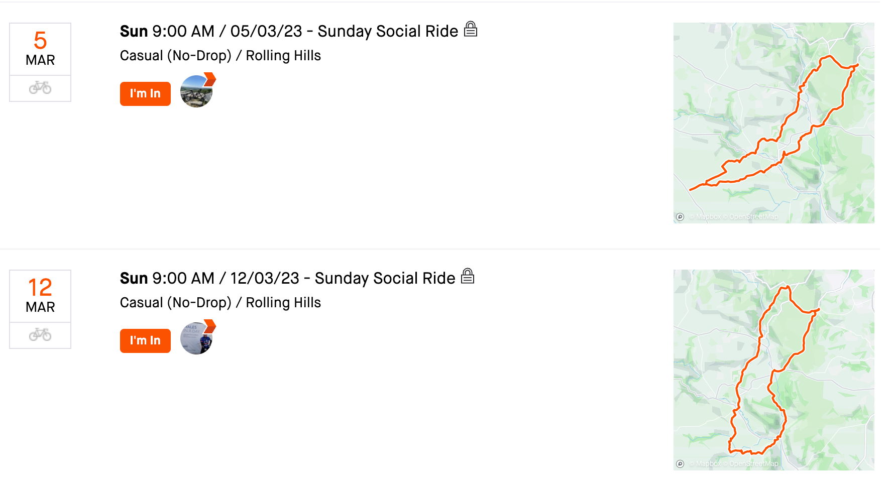
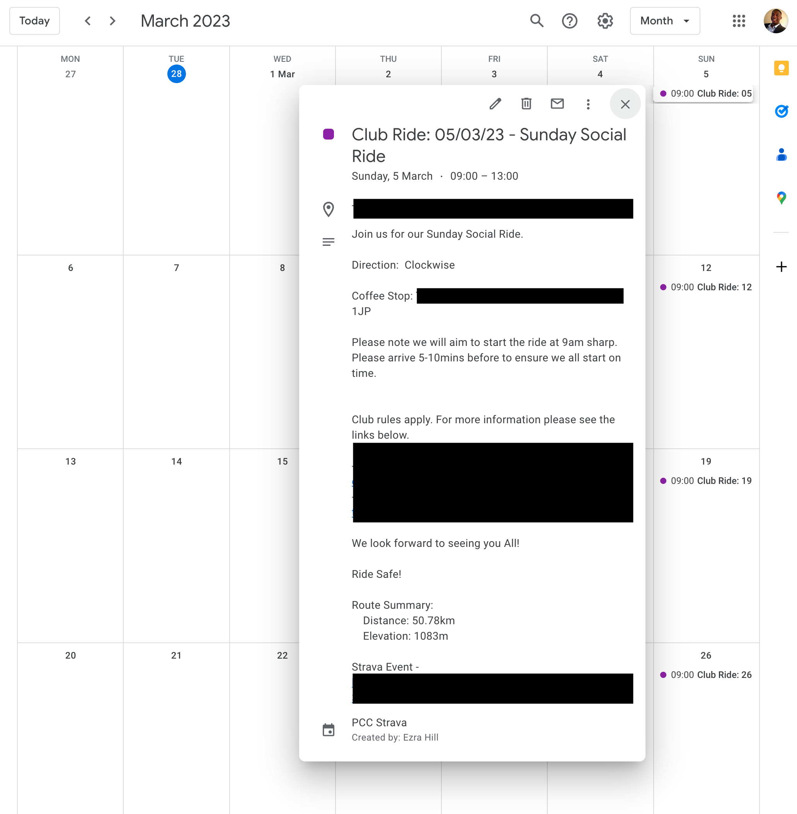

# Strava Club Events -> Google Calendar

> Bring Strava Club Events to your personal Google Calendar

In order to better keep track of Strava Club Events I thought a good solution was to add them to a Google Calendar.




## Requires

- Google Credentials File
  1. [Create Google Project](https://console.cloud.google.com/projectcreate)
  2. [Configure OAuth Consent Screen](https://console.cloud.google.com/apis/credentials/consent)
  3. [Create OAuth Client Cerdentails](https://console.cloud.google.com/apis/credentials/oauthclient)
  4. Download file and rename `crendentials.json`
- [Strava API Key](https://www.strava.com/settings/api)
- Create `secrets.py` ile as per below and update the values to your own

### secrets.py

```python
client_id = '12345'  # Strava User ID
client_secret = '123456789'  # Strava API Secret
refresh_token = '123456789'  # Strava API Refresh Token
google_api_key = '123456789'  # Google API Key
club_id = '123456'  # Strava Club ID
gc_id_prefix = 'cec'  # Google Calendar Entry ID Prefix
calendar_name = 'Club Event Cal'  # Google Calendar Name
```

## Usage

```
$ python cal_update.py
```

## Example Output

```bash
$ python cal_update.py
Getting calendar list...
Get Token - Response HTTP Status Code: 200
Get Events - Response HTTP Status Code: 200
ID:9318202 - Google Calendar Event Already Created
ID:9318209 - Google Calendar Event Already Created
ID:9266782 - Google Calendar Event Already Created
ID:9334241 - No Google Calendar Event, Creating...
Get Route - Response HTTP Status Code: 200
ID:9334241 - Created Google Calendar Entry
ID:9334253 - No Google Calendar Event, Creating...
Get Route - Response HTTP Status Code: 200
ID:9334253 - Created Google Calendar Entry
ID:9334263 - No Google Calendar Event, Creating...
Get Route - Response HTTP Status Code: 200
ID:9334263 - Created Google Calendar Entry
ID:9334289 - No Google Calendar Event, Creating...
Get Route - Response HTTP Status Code: 200
ID:9334289 - Created Google Calendar Entry
```
